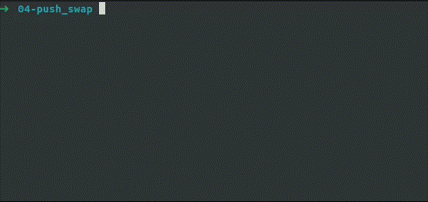

# push_swap

## Description

`push_swap` is a sorting algorithm project created at École 42. It aims to sort data on a stack using a predefined set of instructions and the least number of moves. The project involves manipulating two stacks (`stack_a` and `stack_b`) and using operations such as `push`, `swap`, `rotate`, and `reverse rotate` to achieve an efficient sorting algorithm.

## Features

- Implements sorting algorithms like radix sort and small sort algorithms (for smaller sets of numbers).
- Uses two stacks to efficiently sort numbers with the smallest possible set of operations.
- Handles inputs as numbers, validates arguments, and checks for duplicates.
- Error handling is provided for invalid inputs and memory management.

## Compilation and Usage

You can compile the project using the provided `Makefile`. To compile the `push_swap` executable, simply run:

```bash
make
```

This will produce the `push_swap` executable.

## Project Structure

- `push_swap.c`: Main program that handles the logic of the sorting algorithm.
- `moves/`: Contains the implementations of the stack manipulation operations like push, swap, rotate, and reverse rotate.
- `sorting/`: Contains the radix and small sort implementations for sorting the stacks.
- `stacks/`: Functions to manage stack operations, such as checking for duplicates, managing indices, and more.
- `utils/`: Utility functions for memory management and error handling.
- `minilib/`: Custom implementations of basic C library functions such as `ft_split`, `ft_atoi`, and list management functions.
- `Makefile`: Used for compiling the program and managing build targets.

## How to Use
Once compiled, run the program using the following format:
```bash
./push_swap [numbers to sort]
```

Example:
```bash
./push_swap 4 67 3 87 23
```

## Output

The program will output the series of operations required to sort the numbers from stack_a into ascending order, using stack_b as temporary storage. The available operations are:

- `sa`: Swap the first two elements of `stack_a`. Does nothing if there is only one or no elements.
- `sb`: Swap the first two elements of `stack_b`. Does nothing if there is only one or no elements.
- `ss`: Swap both `stack_a` and `stack_b` at the same time.
- `pa`: Push the top element of `stack_b` onto `stack_a`. Does nothing if `stack_b` is empty.
- `pb`: Push the top element of `stack_a` onto `stack_b`. Does nothing if `stack_a` is empty.
- `ra`: Rotate `stack_a` upwards (the first element becomes the last one).
- `rb`: Rotate `stack_b` upwards (the first element becomes the last one).
- `rr`: Rotate both `stack_a` and `stack_b` upwards at the same time.
- `rra`: Reverse rotate `stack_a` (the last element becomes the first one).
- `rrb`: Reverse rotate `stack_b` (the last element becomes the first one).
- `rrr`: Reverse rotate both `stack_a` and `stack_b` at the same time.

#### Example output

For the input:
```bash
./push_swap 4 67 3 87 23
```

The program might output the following operations:
```
pb     # Push the top element (4) of stack_a to stack_b
ra     # Rotate stack_a upwards, moving 67 to the top
pb     # Push the top element (67) of stack_a to stack_b
ra     # Rotate stack_a upwards, moving 87 to the top
sa     # Swap the top two elements of stack_a (3 and 87)
pa     # Push the top element (67) of stack_b back to stack_a
pa     # Push the top element (4) of stack_b back to stack_a
```

In this example, the numbers are sorted with a minimal set of operations using the available instructions. The goal of the project is to minimize the number of operations needed to sort the given list of numbers.

## Visualizer:

To visualize the sorting process, follow these steps:

1. **Install the [push_swap_gui](https://pypi.org/project/push-swap-gui/) package:** First, ensure `tkinter` is installed for GUI support, then install the visualizer using `pip`:
```bash
pip3 install push_swap_gui
```

2. **Run your `push_swap` program and save the output:** Generate random numbers, run the `push_swap` program, and save the output (instructions) to a file:
```bash
./push_swap $(python3 num-gen.py) > result.txt
```

3. **Visualize the operations:** Open the visualizer and load the `result.txt` file to see the sorting process:
```bash
python3 -m push_swap_gui result.txt
```

The visualizer will show how the numbers are moved between the stacks in real-time.

### Command line


### Visualizer


## Author

Project developed by [Emin A.](https://github.com/emayia) as part of the École 42 curriculum.